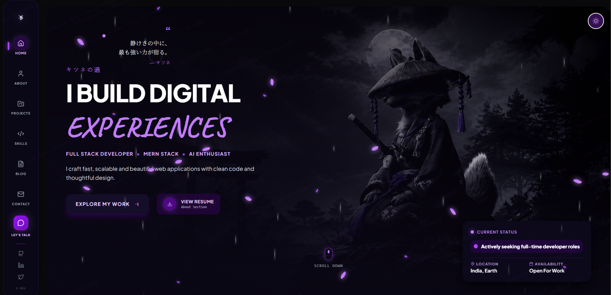
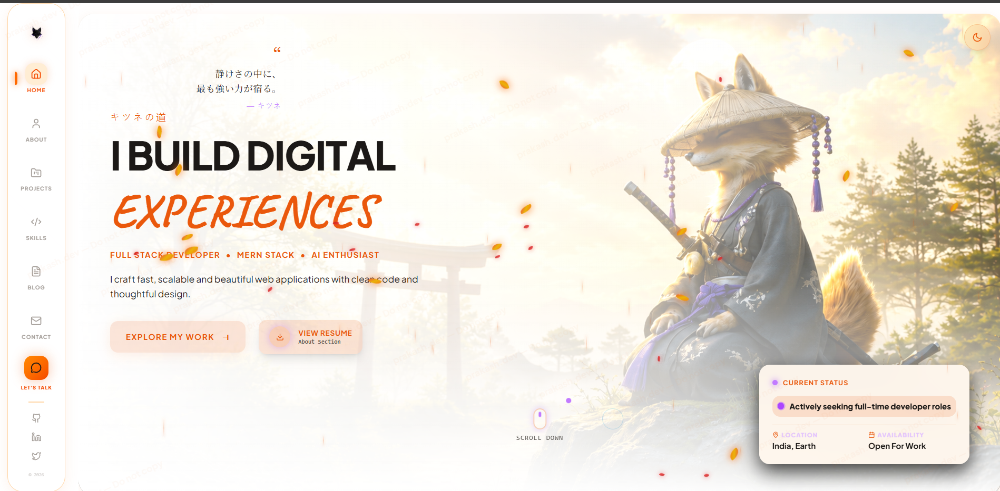

<div align="center">

# Kitsune Developer Portfolio

hey, this is **Prakash** — i built this portfolio to showcase my work and skills as a full stack developer.

it's a single page app with a japanese kitsune aesthetic, dual theme support, and a bunch of custom animations. took me a while to get everything right but i'm pretty happy with how it turned out.

</div>

---

### 📸 Preview





---

## what's inside

- **hero section** — cinematic header with kitsune artwork, falling particle effects, and a status indicator
- **about me** — my journey, stats, philosophy, and a timeline of how i got here
- **projects** — sticky stacking cards with laptop mockups showing my work (AI Battle Arena is live, more coming soon)
- **skills** — categorized tech stack with proficiency rings and brand logos
- **blog** — knowledge archive with articles on AI, frontend, backend, and system design
- **contact** — working contact form powered by EmailJS
- **AI assistant** — a little chat bot that answers questions about me

plus a custom cursor, loading screen, theme toggle with animated transitions, and a bunch of micro-interactions throughout.

## tech stack

| what | why |
|------|-----|
| React 19 | component based UI, hooks, all the good stuff |
| Vite 8 | fast builds, instant HMR |
| Tailwind CSS v4 | utility classes, makes styling actually fun |
| Framer Motion | page transitions, scroll animations, physics based particles |
| GSAP | custom cursor, timeline animations |
| Lucide React | clean icon set |
| EmailJS | contact form without a backend |

## dual theme

there are two themes — a dark purple/black mode and a light warm orange/cream mode. the toggle does a cool line-split animation with the logo. i spent way too long on that transition honestly.

## getting started

you'll need node.js v18+ and npm.

```bash
git clone https://github.com/kaku-coder/portfolio.git
cd portfolio/frontend
npm install
npm run dev
```

open `http://localhost:5173` and you're good to go.

to build for production:

```bash
npm run build
```

output goes to `dist/`.

## deployment

this is set up for **vercel** out of the box. just connect your github repo and it should work.

if you want to deploy somewhere else, the `dist/` folder is a static site — works on netlify, cloudflare pages, github pages, whatever.

## project structure

```
frontend/
├── public/                  # favicon, resume pdf
├── src/
│   ├── assets/              # images, logos, project screenshots
│   ├── components/          # reusable stuff
│   │   ├── Sidebar.jsx
│   │   ├── LoadingScreen.jsx
│   │   ├── MagneticCursor.jsx
│   │   ├── AIAssistant.jsx
│   │   ├── ScrollReveal.jsx
│   │   ├── TextReveal.jsx
│   │   ├── StaggerCards.jsx
│   │   ├── CounterAnimation.jsx
│   │   ├── AtmosphereLayer.jsx
│   │   └── ImagePetals.jsx
│   ├── pages/               # main sections
│   │   ├── HomePage.jsx
│   │   ├── Aboutpage.jsx
│   │   ├── Projectpage.jsx
│   │   ├── Skillpage.jsx
│   │   ├── Blogpage.jsx
│   │   └── Contactpage.jsx
│   ├── hooks/
│   │   └── useGitHub.js     # live github stats
│   ├── App.jsx
│   ├── main.jsx
│   └── index.css            # themes, animations, custom styles
├── index.html
├── vite.config.js
└── package.json
```

## protecting my work

this portfolio has anti-copy protections in place — right click is disabled, devtools shortcuts are blocked, and there's a watermark overlay. if you're thinking of copying the design, please don't. build your own thing, it's more rewarding.

## author

**Prakash** — full stack developer from India

- github: [kaku-coder](https://github.com/kaku-coder)
- linkedin: [linkedin.com/in/prakash](https://linkedin.com/in/prakash)
- twitter: [@prakash70394254](https://x.com/prakash70394254)
- email: prakashdasdev1@gmail.com

## license

MIT — do whatever you want with it, just don't copy the design wholesale. be original.

---

if you made it this far, thanks for reading. star the repo if you liked it.
